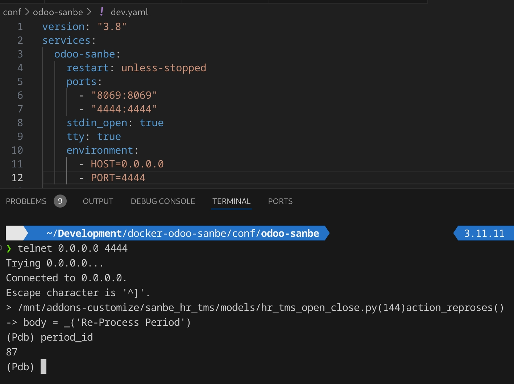

+++
title = 'Cara Debug Odoo Di Docker Menggunakan Pdb'
date = '2024-12-16T13:27:39+07:00'
draft = false
description = ''
categories = ['Web Dev']
tags = ['docker', 'odoo']
+++

## Latar Belakang Masalah

Untuk melakukan debugging di odoo, ada beberapa cara. Yang paling direkomendasikan adalah
menggunakan python package `pdb`.
Sayangnya, ketika develop Odoo menggunakan docker. Perlu ada konfigurasi khusus agar kita bisa menggunakan
package tersebut.

Dalam praktik kali ini saya mengasumsikan teman-teman sudah [menginstall odoo menggunakan docker](https://rohimoz28.github.io/blog/install-odoo-menggunakan-docker/).
Kali ini, kita akan menggunakan VSCode sebagai text editor.

Ada dua cara untuk melakukan debugging saat develop menggunakan docker.

## 1. Menggunakan Metode Attach Container
**Baik digunakan** di local development environment. \
Karena tidak akan mengganggu STDIN dari program dan bisa melalui remote debugging.
Tambahkan kedua line dibawah ini pada pengaturan `docker-compose.yaml`.

```dockerfile
version: "3.8"
services:
  odoo-sanbe:
    restart: unless-stopped
    ports:
      - "8069:8069"
    stdin_open: true    #1
    tty: true           #2
```

Jika sudah, restart docker service-nya.
Selanjutnya, yang perlu dilakukan teman-teman adalah:
1. Trigger method yang akan di debug. \
Misal, saya akan melakukan debug pada function `action_reproses`.
2. Jalankan docker attach menggunakan command `docker attach container_name`. \
Misal, `docker attach odoo-sanbe`


## 2. Menggunakan Python Package
**Baik digunakan** ketika production environment. \
Tambahkan enam line baru dibawah ini pada pengaturan `docker-compose.yaml`.

```dockerfile
version: "3.8"
services:
  odoo-sanbe:
    restart: unless-stopped
    ports:
      - "8069:8069"
      - "4444:4444"     #1
    stdin_open: true    #2
    tty: true           #3
    environment:        #4
      - HOST=0.0.0.0    #5
      - PORT=4444       #6
```

Untuk keperluan remote debugging, kita akan menggunakan `telnet`.
**Pengguna Windows**
Aktifkan `telnet` dengan menjalankan `pkgmgr /iu:"TelnetClient"` pada terminal.

Jika sudah, restart docker service-nya.
Kali ini, yang perlu teman-teman lakukan adalah:
1. Trigger method yang ingin di debug.
2. Jalankan remote debugging menggunakan telnet. Yaitu, `telnet {ip_addres_container} {port}`. \
Misal, `telnet 0.0.0.0 4444`.



## Kesimpulan
Debugging python menggunakan `pdb` sangat di rekomendasikan karena mendukung interactive debugging
menggunakan command line dan juga kemudahan dalam penggunaannya.

Secara keseluruhan, dibawah ini adalah perbedaan penggunaan `pdb` dengan `docker attach` dan juga remote debugging
menggunakan package `remote-pdb`.

| **Feature**             | `remote-pdb`                       | `pdb` with `docker attach`            |
|-------------------------|------------------------------------|---------------------------------------|
| **Connection**          | Remote via network (IP + port)     | Local via container STDIN/STDOUT      |
| **Ease of Use**         | Requires telnet or similar tool    | Requires docker attach                |
| **Detached Containers** | Works seamlessly                   | Must attach to interact with debugger |
| **Flexibility**         | Debug locally within the container | Debug locally within the container    |
| **Port Requirement**    | Needs an exposed port              | No port required                      |
| **Interference**        | Does not block container input     | Blocks STDIN and may interfere        |

Sekian saja untuk kali ini. Terimakasih!