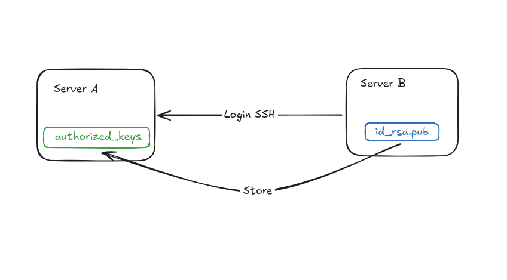

+++
title = 'Cara Koneksi SSH Tanpa Password'
date = '2025-03-07T21:13:39+07:00'
draft = false
description = 'Ada saatnya kita perlu login SSH ke server tanpa harus input password.'
categories= ['Dev Ops']
tags = ['linux']
+++
## Latar Belakang Masalah
Akan datang saatnya ketika kita perlu membuat koneksi dari server A ke server B menggunakan SSH. Namun,

kita sebal atau memang mengganggu proses otamasi karena harus selalu input password ketika login menggunakan SSH.

## Tujuan
Kita akan coba melakukan login menggunakan SSH ke server lain tanpa harus input password.

## Store SSH pada Authorized Keys

Intinya, di server A itu harus punya kartu pass milik server B!

Analoginya, misal kita ingin memasuki sebuah ruangan yang punya level keamanan tinggi. Dimana, hanya karyawan yang memiliki ID Card yang sudah di daftarkan saja yang bisa memasukinya.

Nah, ID Card itu adalah id_rsa.pub dari server B.

Sementara itu, authorized_keys adalah mesin registrasi di server A .

Kalian bisa mendaftarkannya secara manual atau sebaiknya (rekomendasi) menggunakan cara berikut,

1. login ke server B
2. buat ssh jika belum punya,
3. lalu ketikkan : ssh-copy-id user@server_a_ip_address

ubah user → user login SSH server A

server_a_ip_address → ip address server A

## Kesimpulan
Dengan menyimpan id_rsa.pub server B di authorized_keys di server A. Selanjutnya ketika kita akan coba login SSH ke server A dari server B, kita tidak perlu lagi untuk input password.

Terimakasih!