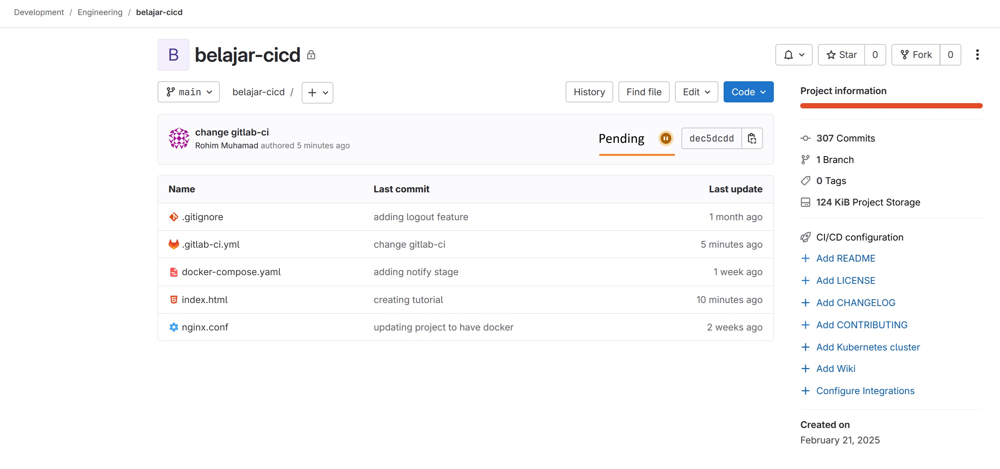
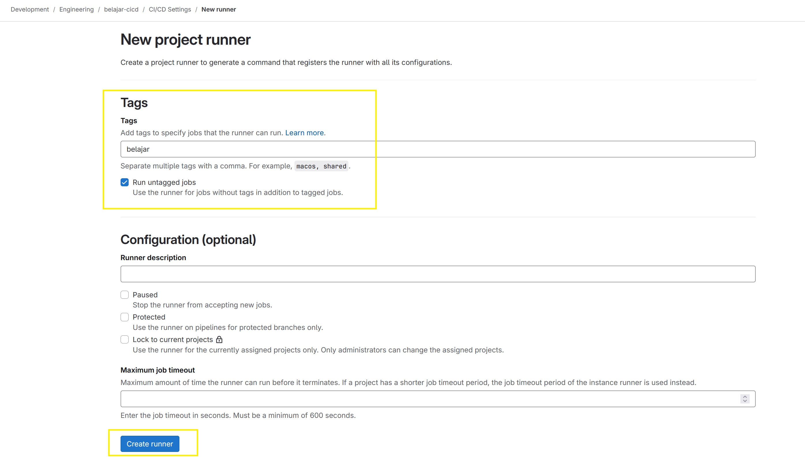
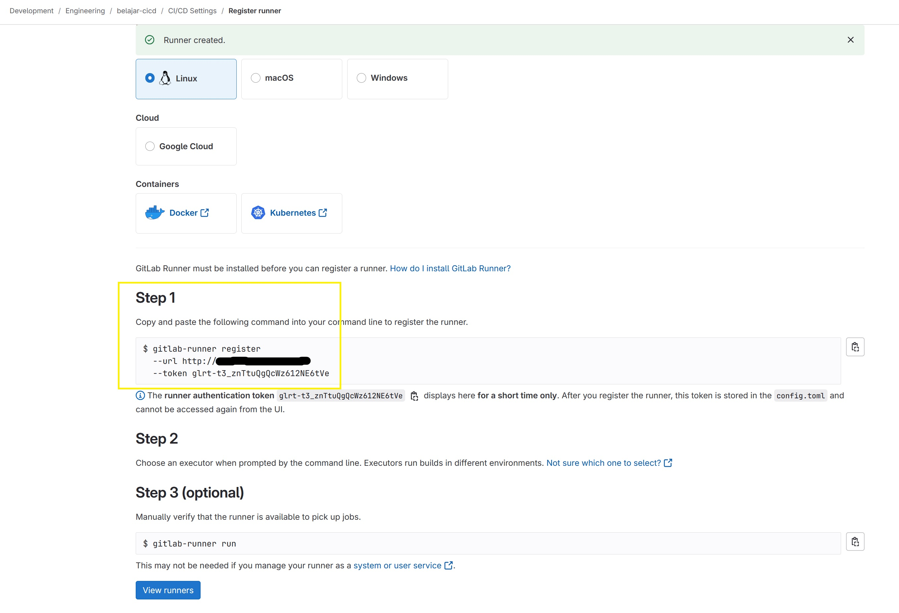
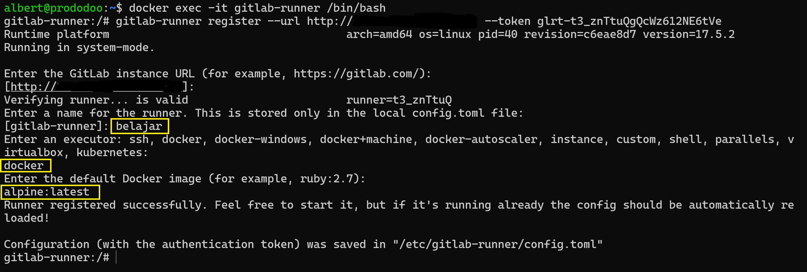
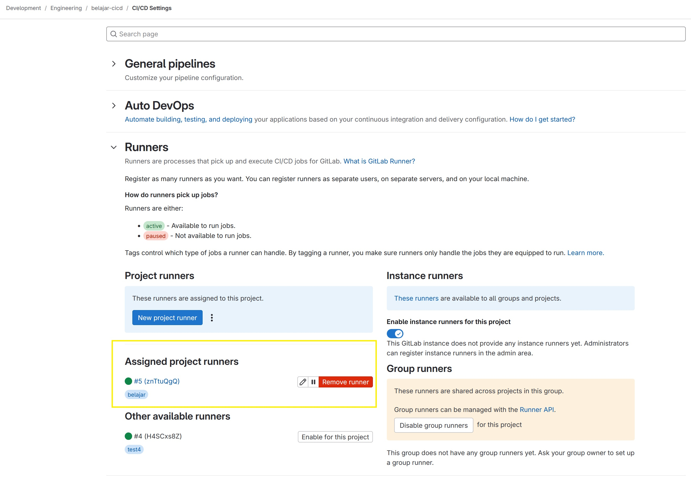

+++
title = 'Konfigurasi Dasar CI/CD Gitlab'
date = '2025-02-20T15:32:40+07:00'
draft = true
description = 'Berikut ini adalah konfigurasi dasar file gitlab-ci.yml yang digunakan untuk CI/CD pada Gitlab.'
categories= ['Gitlab', 'Dev Ops', 'CI/CD']
tags = ['docker', 'odoo']
+++

## Persyaratan
Saya menggunakan Gilab self-hosted dan gitlab-runner yang di install menggunakan docker.

Jika belum dan ingin install GitLab self-hosted bisa lihat caranya [disini](https://rohimoz28.github.io/blog/install-gitlab-community/).

Jika ingin install GitLab Runner menggunakan docker bisa lihat caranya [disini](https://rohimoz28.github.io/blog/install-gitlab-runner/).

## Buat job sederhana
Sekarang kita akan coba membuat job sederhana. Job yang dijalankan akan seperti ini:
1. Job akan ke trigger jika ada perubahan di branch main.
2. Job akan menjalankan stages build dan deploy.
3. Job akan dijalankan di dalam docker.

## Membuat file .gitlab-ci.yml
```
stages:
  - build
  - deploy

build:
  stage: build
  image: alpine:latest
  script:
    - echo "Starting build stages..."
    - echo "Running another command..."

deploy:
  stage: deploy
  image: alpine:latest
  script:
    - echo "Starting deploy stages..."
    - echo "Running another command..."
    - echo "job finished!"
```

Kemudian, save perubahan tersebut pada gitlab atau push perubahan tersebut ke gitlab pada branch main.

### Register Runner
Jika kita ke repository yang ada di gitlab, maka kita akan melihat seperti gambar di bawah ini.


Selanjutnya kita klik notifikasi tersebut, maka akan dijelaskan bahwa job yang pending tersebut dikarenakan belum ada runner yang di assigned ke project tersebut.


Untuk register runner baru, kita akan buat dihalaman _Settings | CI/CD | Runners | New Project Runners_


Selanjutnya, kita akan membuat runner baru.


Maka, kita akan terbuat token baru. Kita copy token tersebut ke dalam container gitlab-runner.


Mari kita daftarkan token tersebut.


Lalu kita kembali ke halaman runner pada gitlab.


Dan dihalaman awal repository kita akan muncul notifikasi bahwa job kita yang tadinya pending menjadi success.


## Kesimpulan
Kita telah selesai untuk install gitlab self-hosted, gitlab runner dan juga coba membuat job pipeline sederhana. 
Pemanfaatan CI/CD ini ada banyak, seperti testing, pembuatan changelog otomatis dll.

Terimakasih!
