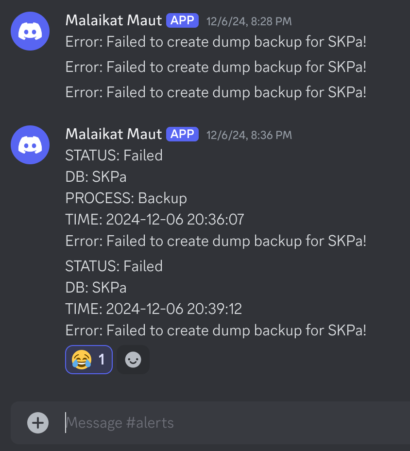

+++
title = 'Membuat Notifikasi Menggunakan Webhook Discord'
date = '2024-12-14T12:26:32+07:00'
draft = false
description = 'Cara Membuat Notifikasi Event Realtime Menggunakan Webhook Discord'
tags = ['webhook']
categories = ['DevOps']
+++


## Webhook
Webhook adalah sebuah metode untuk memungkinkan aplikasi atau layanan berkomunikasi satu sama lain secara otomatis melalui HTTP request.
Secara sederhana, webhook adalah cara bagi satu aplikasi untuk memberi tahu aplikasi lain tentang suatu kejadian (event) atau peristiwa yang terjadi secara real-time.

## Keuntungan Menggunakan Webhook
- **Real-Time**: Webhook memungkinkan komunikasi yang cepat dan real-time antara aplikasi atau sistem.
- **Efisien**: Daripada aplikasi penerima harus secara terus-menerus memeriksa data (polling), webhook hanya mengirimkan data ketika terjadi perubahan, sehingga lebih efisien dalam hal penggunaan sumber daya.
- **Automatisasi**: Webhook dapat digunakan untuk mengotomatisasi alur kerja atau tindakan berdasarkan event yang terjadi, seperti mengirimkan pemberitahuan, memperbarui database, atau menjalankan skrip otomatis.

## Latar Belakang Masalah
Ketika melakukan event mengeksekusi di server menggunakan script `.sh` perlu ada mekanisme mengirim notifikasi ketika ada error dalam proses tersebut.
Ada banyak pilihan, tapi disini saya memilih untuk menggunakan Webhook Discord.

Alasannya, pertama gratis. Kedua, karena discord adalah chat. Maka, kita bisa mengajak orang-orang yang berkepentingan terhadap notifikasi tersebut kedalam group chat.

## Mendapatkan URL Webhook Discord


## Contoh Script Backup Database Dengan Webhook
```shell
#!/bin/bash

# Define variables
BACKUP_DIR="/path/to/your/backup/dir"
DB_NAME="database_name"
DB_USER="your_username"
DB_PASSWORD="your_password"
DB_HOST="ip_address"
DISCORD_WEBHOOK_URL="your_discord_webhook_url"

# Define a function to send a message to Discord
send_discord_notification() {
    local message=$1
    
    # Construct payload
    local payload=$(cat <<EOF
{
  "content": "$message"
}
EOF
)

    # Send POST request to Discord Webhook
    curl -H "Content-Type: application/json" -X POST -d "$payload" $DISCORD_WEBHOOK_URL
}

# Get the current timestamp
TIME_NOW=$(date +"%Y-%m-%d %H:%M:%S")

# Check if backup directory exists, if not create it
if [ ! -d "$BACKUP_DIR" ]; then
    mkdir -p "$BACKUP_DIR"
    if [ $? -ne 0 ]; then
        send_discord_notification "STATUS: Failed\nDB: $DB_NAME\nPROCESS: Backup\nTIME: $TIME_NOW\nError: Could not create backup directory: $BACKUP_DIR. Check your permissions."
        echo "Error: Could not create backup directory: $BACKUP_DIR. Check your permissions."
        exit 1
    fi
    echo "Backup directory created: $BACKUP_DIR"
fi

# Get current date and backup file paths
TODAY=$(date +"%Y-%m-%d")
BACKUP_FILE_TODAY="${BACKUP_DIR}/backup_dir_name_${TODAY}.dump"
BACKUP_GZ_TODAY="${BACKUP_FILE_TODAY}.gz"

# Export the PostgreSQL password
export PGPASSWORD="$DB_PASSWORD"

# Create today's backup as .dump format
if ! pg_dump -U "$DB_USER" -h "$DB_HOST" -F c -b -v -f "$BACKUP_FILE_TODAY" "$DB_NAME"; then
    send_discord_notification "STATUS: Failed\nDB: $DB_NAME\nPROCESS: Backup\nTIME: $TIME_NOW\nError: Failed to create dump backup for $DB_NAME!"
    echo "Failed to create dump backup!"
    exit 1
else
    echo "Created today's dump backup: $BACKUP_FILE_TODAY"
fi

# Check if the dump backup file was created before compressing
if [ ! -f "$BACKUP_FILE_TODAY" ]; then
    send_discord_notification "STATUS: Failed\nDB: $DB_NAME\nPROCESS: Backup\nTIME: $TIME_NOW\nError: Dump backup file not found for compression: $BACKUP_FILE_TODAY"
    echo "Dump backup file not found for compression: $BACKUP_FILE_TODAY"
    exit 1
else
    # Compress the dump file into a gzipped file
    if ! gzip "$BACKUP_FILE_TODAY"; then
        send_discord_notification "STATUS: Failed\nDB: $DB_NAME\nPROCESS: Backup\nTIME: $TIME_NOW\nError: Failed to compress the backup file!"
        echo "Failed to compress the backup file!"
        exit 1
    else
        echo "Compressed dump backup into GZ: $BACKUP_GZ_TODAY"
    fi
fi

# Delete .gz backup files older than 7 days
if ! find "$BACKUP_DIR" -name "*.gz" -type f -mtime +7 -exec rm {} \; ; then
    send_discord_notification "STATUS: Failed\nDB: $DB_NAME\nPROCESS: Backup\nTIME: $TIME_NOW\nError: Failed to delete backup files older than 7 days."
    echo "Failed to delete backup files older than 7 days."
    exit 1
else
    echo "Deleted backup files older than 7 days."
fi

# Send a final notification for successful completion (optional)
# send_discord_notification "Backup process completed successfully for database $DB_NAME."
```

## Contoh Message Webhook Pada Discord


## Kesimpulan
Implementasi webhook bisa dilakukan di banyak hal. Salah satunya untuk mengirim message secara
real-time. Dengan menggunakan cara ini, kita bisa membuat monitoring notifikasi yang tersentralisasi pada chat Discord.
Kedepannya, bisa juga menambahkan orang-orang yang memerlukan notifikasi tersebut kedalam grup chat.

Terimakasih!
